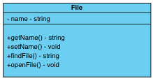
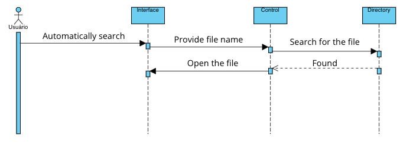
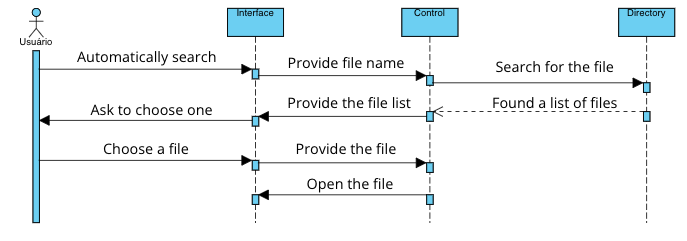
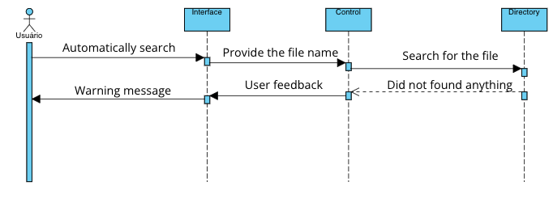

## Architectural Sketch (Esboço de arquitetura)

O projeto conta com novas funcionalidades que incluem tanto abrir automaticamente o pdf relacionado a um arquivo de anotação, quanto a abrir um arquivo de anotação relacionado a um pdf.
A classe a seguir pode ser tanto um arquivo pdf quanto um de anotação.

Cada arquivo tem um nome e funções relacionadas. Primeiro o nome do arquivo aberto deve ser fornecido e setado na classe com seu setter (setName()), depois conforme o fluxo for criado, o arquivo será buscado no diretório atual através do método findFile(), e finalmente quando um arquivo válido for encontrado, ele deverá ser aberto através do método openFile().

### Classe

### Fluxos

Existem 3 fluxos possíveis:

1. O arquivo de anotação ou pdf relacionado é encontrado.

2. Uma lista de arquivos similares é fornecida ao usuário e ele escolhe qual deseja abrir.
   

3. Nenhum arquivo válido foi encontrado e o usuário é alertado.
   

